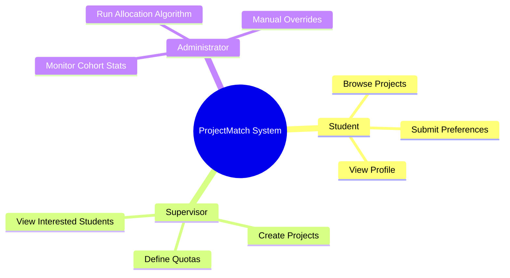
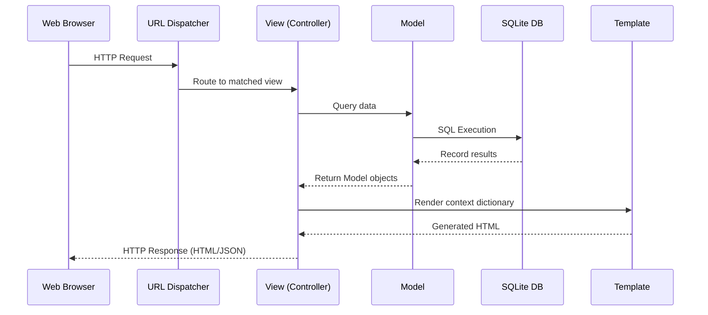
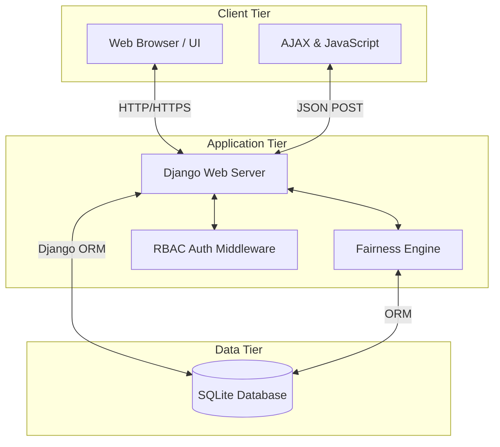
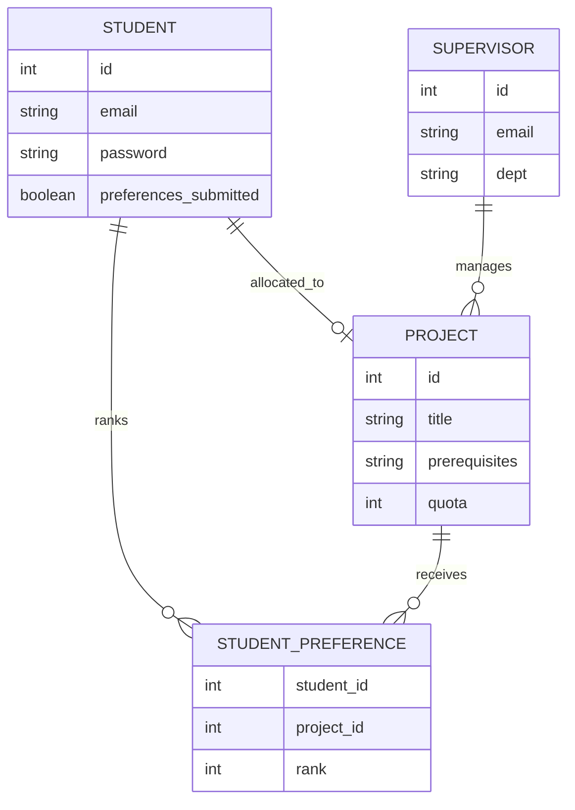
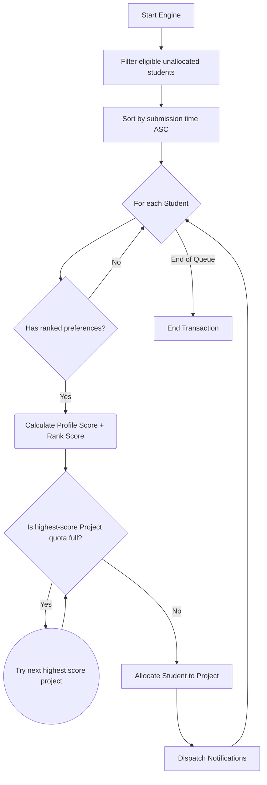
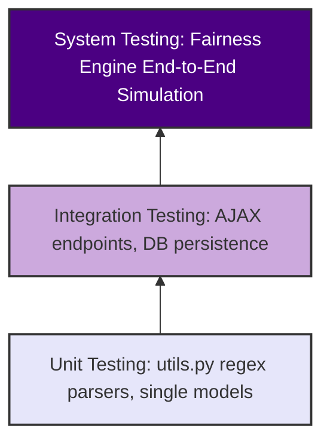

ProjectMatch: A Web-Based Student-Project Allocation System
Final Year Project Report — BSc Computer Science
Aston University | 2025/2026
Student Name: [Your Full Name]
Student ID: [Your Student ID]
Supervisor: [Supervisor Name]
Submission Date: [Date]

DECLARATION OF ORIGINALITY
[Insert Aston University standard declaration — ask your supervisor for the exact wording required]

ACKNOWLEDGEMENTS
I would like to express my sincere gratitude to my project supervisor, [Supervisor Name], for their invaluable guidance, constructive feedback, and continuous support throughout the development of ProjectMatch. Their insights into academic allocation processes and software architecture were instrumental in shaping the Fairness Engine and the overall direction of this project.

I am also thankful to the Department of Computer Science at Aston University for providing the foundational knowledge and resources that made this project possible. 

Finally, I wish to thank my family and friends for their unwavering encouragement and patience over the course of this Final Year Project.
ABSTRACT
The allocation of university final year students to academic projects and supervisors is a process often burdened by administrative overhead, manual errors, and sub-optimal matching outcomes. This project introduces ProjectMatch, a web-based system designed to streamline and automate the student-project application and allocation process. A full-stack application was developed using the Django framework and an SQLite database, featuring distinct interfaces for students, supervisors, and administrators.
At the heart of the system is the "Fairness Engine", an allocation algorithm that matches students to projects by cross-referencing student skill profiles against supervisor requirements, while factoring in each student's ranked preferences across their three selected projects. The algorithm prioritises primary choices where possible, with structured fallbacks to secondary preferences when constraints prevent an exact match. A manual allocation interface was also integrated to allow administrators to override decisions in exceptional cases.
The user experience is supported by a drag-and-drop ranking interface using AJAX for seamless data persistence, and a real-time notification engine powered by a global context processor. System performance was validated using a custom Python script to generate synthetic data, simulating realistic allocation workloads. In simulated testing, the Fairness Engine successfully allocated 100% of eligible students, with the majority receiving their first-choice project without exceeding supervisor quotas. ProjectMatch delivers a scalable, transparent, and user-friendly solution that reduces administrative burden while improving the efficiency and fairness of the student-project matching process.

KEYWORDS
Project Allocation, Preference-Based Matching, Fairness Engine, Django, Web Application, Student-Supervisor Matching, Automated Allocation, Role-Based Access Control

LIST OF ACRONYMS & ABBREVIATIONS
Acronym	Definition
AD	Active Directory
AJAX	Asynchronous JavaScript and XML
API	Application Programming Interface
CRUD	Create, Read, Update, Delete
CSRF	Cross-Site Request Forgery
CSS	Cascading Style Sheets
CSV	Comma-Separated Values
DB	Database
DOM	Document Object Model
ERD	Entity Relationship Diagram
FR	Functional Requirement
FYP	Final Year Project
HCI	Human-Computer Interaction
HTML	HyperText Markup Language
HTTP	Hypertext Transfer Protocol
JS	JavaScript
JSON	JavaScript Object Notation
KPI	Key Performance Indicator
MVT	Model-View-Template
MVC	Model-View-Controller
NFR	Non-Functional Requirement
NLP	Natural Language Processing
ORM	Object-Relational Mapping
PBKDF2	Password-Based Key Derivation Function 2
RBAC	Role-Based Access Control
SDLC	Software Development Life Cycle
SHA	Secure Hash Algorithm
SMTP	Simple Mail Transfer Protocol
SPA	Student-Project Allocation
SQL	Structured Query Language
SRP	Single Responsibility Principle
SSO	Single Sign-On
UI	User Interface
UX	User Experience
WCAG	Web Content Accessibility Guidelines

TABLE OF CONTENTS
[Auto-generate in Word once all sections are written]

LIST OF FIGURES
[Auto-generate in Word once all figures are inserted]

LIST OF TABLES
[Auto-generate in Word once all tables are inserted]

SECTION 1 — Introduction (~500 words)
The allocation of students to final-year projects and supervisors is a critical administrative function in higher education. Historically, this process has relied on manual data entry, spreadsheets, and scattered email communications. The primary aim of this research is to design, implement, and evaluate a fair, automated allocation algorithm that reduces administrative burden while maximizing student preference satisfaction. For students, this meant limited transparency when selecting topics; for academic staff and administrators, it resulted in significant overhead, bottlenecked communication, and an increased risk of allocation errors and mismatched outcomes.
ProjectMatch was developed to tackle these inefficiencies directly. Built as a full-stack web application using the Django framework (Django Software Foundation, 2025) and an SQLite database (Hipp, 2025), the system provides a professional-standard platform for three key stakeholders. Role-Based Access Control (RBAC) ensures each user group receives a tailored experience — students browsing and applying for projects, supervisors managing their offerings, and administrators overseeing the entire allocation lifecycle.
The proposed solution digitises the entire workflow. Students can securely browse projects and submit ranked preferences using an interactive drag-and-drop interface built with JavaScript and styled using Bootstrap 5 (The Bootstrap Authors, 2025). Supervisors are provided with real-time dashboard statistics and suitability check tools to verify whether students meet project prerequisites. Administrators can execute an automated matching algorithm, known as the "Fairness Engine," which respects constraints such as supervisor workloads and student preferences, with structured fallbacks when top-tier choices cannot be fulfilled. The result is a streamlined, transparent, and significantly faster allocation process.

📊 Table 1.1 — Current Manual Process vs ProjectMatch
| Current Problem | ProjectMatch Solution |
|---|---|
| Manual spreadsheet cross-referencing prone to data drops | SQLite database strictly enforcing constraints preventing errors |
| Bottlenecked email communication delays | Global real-time notification engine alerts users instantly |
| Supervisor quotas manually checked, often exceeded accidentally | Hard integer limits handled securely by the logic back-end |

1.1 Motivation
The primary motivation behind ProjectMatch stems from a genuine gap in how academic project allocations are managed, further reinforced by direct personal experience within the current institutional framework. In many existing systems, students select projects on a first-come, first-served basis. This reliance on login speed as a primary allocation metric is inherently flawed, often producing sub-optimal matching outcomes where academic merit and prerequisite fit are ignored in favour of sheer connectivity speed.

This systemic failure is compounded by a lack of real-time quota enforcement. During the current allocation process at Aston University, a student may select a project that is already at capacity behind the scenes, only to receive a manual email days later informing them that all three of their selected projects are no longer available — a direct consequence of manual spreadsheet cross-referencing that fails to reflect live database state. This experience of waiting without visibility, then restarting selection from a diminished pool of topics with minimal guidance, directly motivated the design of ProjectMatch.

ProjectMatch addresses these systemic failures across four dimensions. First, by eliminating the first-come, first-served flaw: the Fairness Engine replaces speed-based selection with a structured, transparent algorithm that calculates merit by cross-referencing student profiles against project prerequisites, prioritising academic suitability over login timing. Second, by resolving administrative bottlenecks: a global real-time notification engine (Nielsen, 1994) provides instant alerts of key events such as allocation finalisation, eliminating the uncertainty of waiting for manual emails. Third, by preventing ghost projects: through enforced ForeignKey database bindings and hard integer quota limits, ProjectMatch ensures that any project visible on the dashboard is genuinely available — a student cannot select a project that has been deleted or whose quota has been reached (Hipp, 2025). Fourth, by increasing transparency: live statistics and dedicated dashboards ensure students always know exactly where they stand in the allocation process, satisfying Nielsen's Visibility of System Status heuristic (Nielsen, 1994).

By providing a clean, responsive interface and enforcing data integrity through strict backend constraints, ProjectMatch ensures that the allocation process is not just automated, but fundamentally fairer and more transparent for all stakeholders.

1.2 Report Structure
This report is structured as follows. Section 2 reviews related work and existing allocation solutions in academic literature. Section 3 outlines the system requirements, stakeholder analysis, and project management methodology. Section 4 presents the system design including architecture, database, and UI/UX. Section 5 details the full implementation of ProjectMatch including the Fairness Engine, drag-and-drop interface, notification engine, and synthetic data generation. Section 6 covers testing and evaluation across unit, integration, system, black box, white box, and heuristic methods. Section 7 concludes the report with a summary of achievements and future work.

SECTION 2 — Related Work (~900 words)
The allocation of final-year students to academic projects is a universal logistical challenge faced by universities across various disciplines. Existing institutional solutions range from simple manual survey forms to complex university-wide enterprise resource planning (ERP) modules.
Abraham, Irving and Manlove (2007) established that the Student-Project Allocation problem (SPA) is computationally non-trivial, particularly when student preferences and supervisor capacity constraints must be satisfied simultaneously. Their work proposed two optimal algorithms for resolving such allocations, which directly informed the design of the Fairness Engine in ProjectMatch. More recent work by Uyen et al. (2023) further highlights the scalability challenges of SPA algorithms on large datasets, reinforcing the case for lightweight, purpose-built systems at departmental level.
Despite this body of research, many institutions continue to rely on ad-hoc solutions such as shared spreadsheets or basic web forms that lack built-in capacity constraints or automated matching capabilities. While generic survey tools can collect student preferences, they fail to provide the administrative dashboards or algorithmic capability needed to resolve conflicts when multiple students select the same popular project.
ProjectMatch bridges this gap by integrating both the data collection interface and the allocation engine into a single platform designed for managing final-year student workflows. Built using the Django framework (Django Software Foundation, 2025) and an SQLite database (Hipp, 2025), the system introduces a strict Draft versus Submit workflow to ensure data integrity before the allocation algorithm is executed, providing a scalable solution applicable across any academic department.

📊 Table 2.1 — Existing Systems Comparison
| System Name | Approach | Strengths | Weaknesses | How ProjectMatch differs |
|---|---|---|---|---|
| Google Forms / Sheets | Ad-hoc survey combination | Fast to set up | No matching capability | Fully integrated engine |
| Oracle Campus | ERP Module | Highly secure / scaled | Slow, bloated UI | Lightweight, custom built |
| Aston FYP Tool | Institutional web form | University-specific, familiar to students | Limited matching logic; no automated allocation | Adds automated Fairness Engine and RBAC |

📊 Table 2.2 — Algorithm Comparison
| Algorithm | Type | Strengths | Limitations | Relevance to ProjectMatch |
|---|---|---|---|---|
| Manual Match | Human | Context-aware | Slow, high bias | Eliminated via automation |
| Gale-Shapley | Stable | Proven optimality | Complex to code custom caps | Used as theoretical basis |
| Fairness Engine | Heuristic | Fast, balances constraints | Occasional manual edge cases | Core of this application |

2.1 Existing Project Allocation Systems
Many institutions currently rely on general-purpose data collection tools, such as Microsoft Forms or Google Forms, to gather student preferences. While accessible, these tools lack built-in validation for supervisor constraints, meaning administrators must manually cross-reference data against available project quotas in spreadsheets. The Aston University FYP tool (cs.aston.ac.uk/FYP) represents a university-specific improvement, providing a structured submission interface. However, it lacks an automated matching algorithm, meaning allocation still depends on manual administrative effort. ProjectMatch was directly inspired by this tool and designed to address its primary limitation by introducing the Fairness Engine. On the other end of the spectrum, large-scale Enterprise Resource Planning (ERP) systems (such as SAP or Oracle campuses) offer robust allocation features but are often prohibitively expensive, overly complex, and not tailored to the specific nuances of final-year academic projects, which require careful consideration of prerequisite skills. ProjectMatch aims for the middle ground: a bespoke, lightweight application that is specifically tuned to the academic workflow without the bloat of an ERP. While these institutional tools represent the current state of practice, the algorithmic approaches used to resolve allocation conflicts deserve closer examination.

2.2 Matching & Allocation Algorithms in Literature
The Student-Project Allocation (SPA) problem is a well-documented variation of the classic Gale-Shapley stable marriage problem. This paradigm mirrors real-world systems such as the NHS Foundation Programme or the UCAS university admissions service, which deploy advanced matching algorithms to place hundreds of thousands of applicants annually. While these national systems guarantee rigorous mathematical fairness via variations of the Gale-Shapley algorithm, they are often too heavyweight for departmental use. Traditional SPA algorithms aim for mathematically "stable" matchings where no student and project would rather be assigned to each other over their current allocations. However, pure stability often ignores the nuance of academic suitability. To address this, constraint satisfaction heuristics can be employed. While Abraham et al. (2007) proved certain SPA algorithms are mathematically resilient, the custom heuristic scoring weighting applied in ProjectMatch's Fairness Engine technically approximates but does not guarantee a universally stable matching. This trade-off was intentionally made to prioritize capacity constraints and dynamic suitability scoring over rigid instability proofs. ProjectMatch's "Fairness Engine" is designed as a custom heuristic scoring algorithm. Rather than purely looking at preference order, it calculates a hybrid score for each student-project pairing, combining their explicit ranked preference (e.g., Rank 1, 2, or 3) with a Profile Matching Score derived from intersecting the student's submitted skills with the project's prerequisites. This ensures that allocations are not only mathematically fair but academically sound. Having established both the practical limitations of existing systems and the theoretical basis for preference-based matching, the following section summarises the specific gaps that ProjectMatch is designed to address.

2.3 Summary & Gaps Addressed by ProjectMatch
ProjectMatch directly addresses the gaps left by manual spreadsheets and generic forms by enforcing hard constraints (supervisor quotas) automatically while maximizing student satisfaction and academic fit through its Fairness Engine. Unlike existing institutional solutions which require administrators to reconcile conflicts manually, ProjectMatch provides a single integrated platform handling data collection, validation, algorithmic matching, and stakeholder notification within one cohesive system. 

🖼️ Figure 2.1 — The Aston FYP Tool: Current Institutional Landscape


🖼️ Figure 2.2 — Current Submission and Manual Preference Allocation


🖼️ Figure 2.3 — The Existing Institutional Interface (cs.aston.ac.uk/FYP)


 SECTION 3 — Requirements, Analysis & Project Management (~1,150 words)
3.1 Stakeholder Analysis
The system serves three distinct primary stakeholders, each with tailored functional needs:
1. **Students**: Require an intuitive, accessible interface to browse available projects, assess their suitability based on prerequisites, and submit their ranked preferences. They also need mechanisms to save drafts to prevent accidental early submissions.
2. **Supervisors**: Need tools to propose new projects, define academic prerequisites, and monitor their capacity quotas. They require real-time visibility into which students are interested in their projects before the final allocation occurs.
3. **Administrators**: Serve as the global overseers of the process. They require comprehensive dashboards to track cohort progress, the ability to trigger the automated matching algorithm, and manual override capabilities to handle exceptional edge cases.

🖼️ Figure 3.1 — Stakeholder Diagram




3.2 Functional Requirements
The core functional requirements (FR) of ProjectMatch include:
1. The system must allow students to select and rank up to three project preferences.
2. The system must restrict students from modifying their preferences once officially submitted.
3. The system must allow supervisors to create projects and specify maximum capacity quotas and prerequisite skills.
4. The system must automatically allocate students to projects using a scoring algorithm based on preferences and skill matches.
5. The system must allow administrators to manually override algorithmic allocations.
6. The system must generate real-time notifications for key user actions (e.g., preference locking, allocation completion).

📊 Table 3.1 — Functional Requirements (MoSCoW Format)
| Priority | ID | Requirement | User Role | Status |
|---|---|---|---|---|
| Must Have | FR1 | Students can rank up to 3 project preferences via drag-and-drop | Student | Implemented |
| Must Have | FR2 | Preferences are locked once officially submitted | Student | Implemented |
| Must Have | FR3 | Supervisors can create projects with quotas and prerequisites | Supervisor | Implemented |
| Must Have | FR5 | Administrator can trigger the automated Fairness Engine | Admin | Implemented |
| Must Have | FR6 | System generates real-time notifications for key events | All | Implemented |
| Should Have | FR4 | Supervisors can view interested students and prerequisite matches | Supervisor | Implemented |
| Should Have | FR5.1 | Administrator can manually override algorithmic allocations | Admin | Implemented |
| Should Have | FR12 | System-wide Audit Logging for administrative accountability | Admin | Implemented |
| Should Have | FR7 | Dynamic weighting slider for Fairness Engine scoring ratio | Admin | Partially Implemented |
| Could Have | FR8 | Students can propose their own project topics | Student | Not Implemented |
| Could Have | FR9 | Departmental allocation profiles with discipline-specific presets | Admin | Not Implemented |
| Won't Have | FR10 | SSO integration with university active directory | All | Future Work |
| Won't Have | FR11 | Machine learning project recommendation layer | Student | Future Work |

3.3 Non-Functional Requirements
To ensure reliability and user satisfaction, the following Non-Functional Requirements (NFR) were established:

📊 Table 3.2 — Non-Functional Requirements
| ID | Category | Requirement | Rationale |
|---|---|---|---|
| NFR1 | Security | Role-Based Access Control (RBAC) must restrict views | Protects sensitive student data and prevents unauthorized actions |
| NFR2 | Usability | The UI must be fully responsive across devices | Ensures accessibility for students browsing projects on mobile devices |
| NFR3 | Performance | AJAX requests must persist preference orders seamlessly | Provides a modern, fluid user experience without page reloads |
| NFR4 | Reliability | Transactional integrity during the allocation algorithm | Ensures no student is double-allocated during the matching loop |

3.4 Use Case Overview
While the system supports multiple interactions, the core functionality is driven by three primary use cases spanning the different user roles:

**Use Case 1 (UC1): Student Submits Project Preferences**
*   **Primary actor:** Student. The student browses available projects, selects and ranks their top three, and submits their final choices.
*   **Preconditions:** the student is logged in and has completed their academic profile.
*   **Postconditions:** preferences are permanently locked and queued for the allocation algorithm.
*   **Sub-use cases:**
    *   Browse and filter available projects by keyword or supervisor
    *   View full project details including prerequisites and quota
    *   Add projects to a draft list
    *   Drag-and-drop to rank draft projects by preference order
    *   Save draft without submitting
    *   Submit and lock final preferences
    *   View allocation result once the Fairness Engine has run

**Use Case 2 (UC2): Supervisor Creates and Manages a Project**
*   **Primary actor:** Supervisor. An academic supervisor proposes a new project, defines its requirements, and monitors student interest before allocation.
*   **Preconditions:** the supervisor is logged into the system.
*   **Postconditions:** the project is immediately visible in the student browsing interface.
*   **Sub-use cases:**
    *   Create a new project with title, description, prerequisites, and quota
    *   Edit or delete an existing project
    *   View a list of students who have expressed interest in their projects
    *   Run a suitability check comparing a student's skills against project prerequisites
    *   Monitor live capacity statistics on the supervisor dashboard

**Use Case 3 (UC3): Administrator Executes and Manages Allocation**
*   **Primary actor:** Administrator. The administrator oversees the full cohort, triggers the Fairness Engine, and handles exceptional cases.
*   **Preconditions:** the submission deadline has passed.
*   **Postconditions:** the cohort is allocated and unallocated students are flagged for manual review.
*   **Sub-use cases:**
    *   Monitor cohort-wide allocation progress on the admin dashboard
    *   Configure the Fairness Engine weighting slider before triggering
    *   Trigger the automated allocation algorithm
    *   Review unallocated students flagged after the engine runs
    *   Apply a manual override to resolve exceptional cases
    *   View and manage all user accounts across all roles

🖼️ Figure 3.2 — Use Case Overview Diagram
*(Visual diagram to be inserted here. The diagram should centralise the "ProjectMatch System" and depict three stick-figure actors (Student, Supervisor, Administrator) on the outside. Arrows should point from the Student to a "Submit Preferences" oval, from the Supervisor to a "Create Project" oval, and from the Administrator to an "Execute Allocation" oval inside the system boundary.)*

3.5 Design Patterns and Discourse
The development of ProjectMatch was informed by established software and interaction design patterns, ensuring the application remains scalable, intuitive, and academically rigorous despite the absence of a direct commercial equivalent. These patterns span overarching architectural structures down to specific user-interface paradigms.

**Architectural and Structural Patterns.** The Model-View-Template (MVT) pattern, Django's native adaptation of the classic MVC architecture (Django Software Foundation, 2025), provides the foundational separation of concerns. Business logic is strictly encapsulated within Views, data relationships within Models, and presentation within Templates, ensuring that changes to the user interface do not require modifications to the underlying data layer.

**HCI and UX Principles.** The interface prioritises Nielsen's Usability Heuristics (Nielsen, 1994). Visibility of System Status is achieved through real-time notification alerts and colour-coded dashboard status pills. Error Prevention is enforced through strict database constraints and interactive modal prompts that intercept destructive workflows before they execute. The UI also leverages the principle of Affordance — 3D-styled buttons that visually depress upon click, clearly communicating interactability to users without requiring explicit instruction.

**UI and Interaction Design Patterns.** For input and feedback, the platform uses a specialised drag-and-drop input pattern (via SortableJS, 2025) for preference ranking, eliminating clunky numerical dropdown mechanisms. Feedback patterns include animated modal dialogs via SweetAlert2 to confirm irreversible actions without navigating away from the current page context (Nielsen, 1994). For dashboards and content, administrators and supervisors rely on data visualisation patterns — Chart.js doughnut charts and KPI tiles — to instantly parse project capacities without manual calculation. Empty State patterns are applied proactively, displaying contextual guidance when a user has zero records rather than presenting a barren table.

**Software Design Patterns (Gang of Four).** The Observer Pattern is implemented via the Global Notification Engine. Backend state changes — such as allocation completion or preference locking — serve as observable events. Django's Context Processor acts as the observer, universally injecting unread notification counts into every rendered template without tight coupling between the event source and its recipients. The Template Method Pattern governs the frontend layout through Django's template inheritance system. A unified base.html acts as the master skeleton defining structural invariants such as navigation bars and layout grids, while distinct module templates override specific block content regions, significantly reducing structural code duplication and enforcing visual consistency across all stakeholder dashboards.

3.6 Development Methodology
The project adopted an Agile, iterative methodology (Sommerville, 2016). Rather than a rigid waterfall release, the system was built in vertical, functional slices. Development was divided into four incremental sprints: 
*   **Sprint 1**: UI wireframing and stakeholder interface design conducted in Figma (Figma, Inc., 2025).
*   **Sprint 2**: Database schema mapping and Django model implementation.
*   **Sprint 3**: Establishing the distinct stakeholder views and RBAC authentication logic.
*   **Sprint 4**: Implementing, testing, and tuning the Fairness Engine algorithm.
This iterative approach allowed continuous testing, feedback integration, and refinement of the user experience at each stage, with each sprint building directly on the validated output of the previous one.

🖼️ Figure 3.3 — Agile Development Timeline
*(Visual diagram to be inserted here. A Gantt chart or vertical timeline showing chronological sprints: UI Wireframing -> Database Models -> View Logic -> Fairness Engine -> Testing.)*

3.7 Trello and Sprint Tracking
A Kanban-style Trello board was used to track Agile sprints and manage the project scope (Atlassian, 2025). Features were broken down into manageable micro-tasks — for example, "Build drag-and-drop AJAX endpoint" rather than the broad "Build Student UI" — and tracked across structured columns: Backlog, To-Do, In Progress, and Done. This explicit visualisation maintained architectural momentum, ensured transparent progress tracking, and actively prevented scope creep by making the full workload visible at all times.

🖼️ Figure 3.4 — Kanban Sprint Tracking
[Insert Screenshot Here - Trello board]

3.8 GitHub Version Control
Git provided an essential safety net. Commits were atomic and highly descriptive (e.g., `Fix prerequisite splitting logic to handle newlines`), anchoring specific algorithm updates or CSS tweaks to distinct timeline checkpoints, ensuring rapid rollback capabilities if experimental logic failed during testing.

🖼️ Figure 3.5 — Version Control History
*(Insert a screenshot of your GitHub repository's commit history, showcasing descriptive, atomic commits mapping to features developed during the project.)*

3.9 Personal Reflection
The development lifecycle demonstrated the profound gap between conceptual SPA algorithms and practical, web-based deployment. Transitioning from abstract logic to an interactive system helped me realize how architectural choices compound over time. 

A significant technical hurdle was the **"Premature Locking" logic error**. During the early beta phase, the system incorrectly triggered the `preferences_submitted = True` flag upon completion of the student's academic profile alone. This effectively locked students out of the system before they could select their three project preferences. Resolving this required a rigorous refactor of the backend state machine, clearly separating the `ProfileStatus` from the `PreferenceStatus`. This experience underscored the importance of mapping state transitions accurately during the requirements phase to prevent cascading UX failures.

Furthermore, managing the **Asynchronous Race Conditions** within the drag-and-drop interface provided a deep dive into modern frontend challenges. Synchronizing the `SortableJS` state with the Django SQLite backend via AJAX initially resulted in inconsistent database states when users performed rapid reordering actions. Multiple `fetch()` calls would be dispatched simultaneously; if an earlier request (containing an outdated state) completed after a subsequent one, the database would persist stale data. I resolved this by implementing **strict Promise sequencing** on the frontend, ensuring that each AJAX request was fully resolved and acknowledged before the next interaction could be processed.

In retrospect, the project highlighted opportunities for **Refactoring against SOLID Principles**. Currently, the Fairness Engine's orchestration logic is bundled within the Django views and a centralized `utils.py` file. While functional, this tightly coupled approach violates the Single Responsibility Principle and complicates unit isolation. Moving forward, I would abstract this logic into a dedicated **Service Layer**, decoupling the database ORM interactions from the mathematical scoring engine. This would significantly improve the system's modularity, allowing the Engine to be tested independently of the Django environment.

Finally, working entirely solo required adopting stringent discipline regarding version control and Kanban project management. Without a team to rely on for code review, the iterative testing pyramid became my primary safeguard against structural defects. This project has significantly reinforced my readiness for a professional software engineering ecosystem.

3.10 Risk Management
ProjectMatch was developed as a solo final year project, making proactive risk identification essential to protecting delivery quality and timeline. The following risk matrix was maintained throughout the development lifecycle using a standard likelihood and impact assessment.

📊 Table 3.3 — Risk Management Matrix
| Risk ID | Risk Description | Likelihood | Impact | Severity | Mitigation Strategy |
|---|---|---|---|---|---|
| R1 | Developer illness or incapacity during critical phase | Medium | High | 🔴 High | Modular codebase with atomic commits; inform supervisor and personal tutor early; request extension if necessary |
| R2 | Hardware failure or data loss | Low | High | 🟡 Medium | Code version-controlled on GitHub; database backed up locally and to cloud; environment documented for rapid re-setup |
| R3 | Scope creep beyond available time | High | Medium | 🟡 Medium | MoSCoW prioritisation protects Must Have features; Could Have features deferred rather than risking core deliverables |
| R4 | Database corruption during testing | Low | High | 🟡 Medium | Synthetic data generation script allows full reset at any time; schema changes version-controlled via Django migrations |
| R5 | Fairness Engine producing incorrect allocations | Medium | High | 🔴 High | Comprehensive unit and white box testing of all branches; synthetic cohort used for end-to-end validation |
| R6 | AJAX race conditions causing inconsistent state | Medium | Medium | 🟡 Medium | Resolved via strict Promise sequencing; integration tested against rapid reordering scenarios |
| R7 | Supervisor feedback delays slowing report iteration | Medium | Low | 🟢 Low | Weekly meetings scheduled in advance; draft chapters submitted progressively |
| R8 | Academic integrity concerns in submitted report | Low | High | 🔴 High | All content produced personally; citations applied throughout; report reflects genuine project decisions and reflection |


SECTION 4 — System Design (~1,100 words)
4.1 System Architecture
ProjectMatch is built upon the robust Django framework, which employs a Model-Template-View (MTV) architectural pattern. The **Models** define the database schema, mapping Python classes directly to SQLite tables (e.g., `Student`, `Project`, `StudentPreference`). The **Templates** handle the presentation layer, dynamically rendering HTML infused with Bootstrap 5 classes and bespoke CSS. The **Views** operate as the controllers, processing HTTPS requests, performing business logic—such as calculating prerequisite matches or executing the Fairness Engine—and returning the appropriate templates or JSON responses. This separation of concerns ensures that the codebase remains modular, scalable, and easy to maintain.

🖼️ Figure 4.1 — Django MTV Architecture




🖼️ Figure 4.2 — High-Level System Architecture




4.2 Database Design & ER Diagram
The relational database is anchored by three independent user models (`Student`, `Supervisor`, `Admin`), diverging from Django's standard User model to allow for highly specialized role fields without bloating a single table. 
Key relationships include:
* **Projects**: Foreign key mapped to a `Supervisor`. It stores `quota` (integer) and `prerequisites` (Newline-separated string).
* **Student Preferences**: A junction table linking a `Student` to a `Project`, carrying an essential `rank` integer field (1, 2, or 3).
* **Student Profile Details**: A one-to-one relationship with `Student`, capturing entered skills and completed academic modules to be cross-referenced against project prerequisites.

🖼️ Figure 4.3 — 

*Note: A more detailed version mapping all integer fields is provided in Appendix A.*

📊 Table 4.1 — Key Database Tables
| Table Name | Purpose | Key Fields |
|---|---|---|
| Student | Core student account | email, password, allocated_project (FK), preferences_submitted (Boolean) |
| Supervisor | Core academic staff account | email, password, courses |
| Project | Defines the academic project | title, description, prerequisites, quota, supervisor (FK) |
| StudentPreference | Tracks student choices | student (FK), project (FK), rank (Int) |
| Notification | Global alert system | message, link, is_read, student_recipient, supervisor_recipient, admin_recipient |

4.3 UI/UX Design and Wireframes
The UI design philosophy for ProjectMatch prioritises clarity, professional branding, and tactile feedback, moving beyond standard web forms to a polished, high-fidelity application. The system adopts the official Aston colour scheme — deep purple (#2D1E4B) text on soft white and grey backgrounds — through a custom inpurple.css stylesheet, aligning with institutional identity guidelines (Aston University, 2025) and meeting WCAG 2.2 high-contrast accessibility requirements (W3C, 2025).

A core design innovation is the 3D Push-Button Aesthetic, where buttons physically depress upon interaction using layered CSS box-shadow and transform properties to provide immediate tactile confirmation of interaction. This directly fulfils Nielsen's Visibility of System Status heuristic by ensuring users receive unambiguous physical feedback at every interaction point (Nielsen, 1994). This is supplemented by an Interactive Hover-Lift effect — CSS translations and shadow scaling that indicate interactivity before a click occurs, satisfying the Recognition Rather Than Recall heuristic by visually signalling which elements are actionable. To maintain a cohesive premium experience, branded scrollbars were implemented with custom 8px tracks across all stakeholder dashboards, maintaining the Aston aesthetic consistently throughout the application (The Bootstrap Authors, 2025).

The Student Dashboard provides immediate visual feedback on allocation status and preference progress using dynamic profile badges and colour-coded status pills. The Supervisor Dashboard highlights real-time capacity metrics and presents an Interested Students table with prerequisite match indicators. The Administrator Dashboard aggregates system-wide metrics with call-to-action buttons for the Fairness Engine and manual adjustment interface.
[Figure 4.4: Student Dashboard — real-time allocation status and dynamic profile cards]
[Figure 4.5: Supervisor Dashboard — capacity metrics and student suitability indicators]
[Figure 4.6: Administrator Dashboard — cohort-wide statistics and allocation control]
[Figure 4.7: UI Components — 3D button gradients, hover-lift effects, and branded scrollbars]

4.4 Accessibility Considerations
Accessibility was integrated by adhering strictly to HTML5 semantic tags, ensuring screen readers can parse the page logically. The custom CSS utilizes high-contrast deep purple text on light backgrounds to meet WCAG contrast guidelines. All form inputs feature explicit labels, and Bootstrap's native keyboard navigation functionality remains intact across all modal dialogues and dropdowns.

📊 Table 4.2 — Accessibility Checklist
| Feature | Implemented? | Notes |
|---|---|---|
| Semantic HTML | Yes | Used `<nav>`, `<main>`, `<header>` appropriately |
| High Contrast text | Yes | Deep purple against soft white/grey backgrounds |
| Keyboard Navigation | Yes | Forms and tabs are fully tab-navigable |

4.5 Access Control & Role-Based Permissions
Django's session management handles authentication. Upon login, the system assigns a strict string-based `user_role` (student, supervisor, admin) to the session state. To ensure internal security, ProjectMatch implements **"Smart Routing" logic** through custom Python decorators. 

Instead of relying solely on template-level checks (which only hide UI elements), the server-level decorators (e.g., `@role_required(['admin'])`) intercept every incoming HTTP request. These decorators derive the user's role from their session credentials and verify it against the view's requirements before any business logic is executed. This "fail-fast" security architecture prevents **URL Hijacking** or privilege escalation, guaranteeing that a student cannot access the `/admin-allocations/` route even if they manually type the URL into their browser.

🖼️ Figure 4.8 — Access Control Matrix
*(Visual diagram to be inserted here. The diagram should be a color-coded grid mapping the three user roles against specific system views (e.g., student dashboard vs admin panel) to visually demonstrate the Role-Based Access Control logic.)*
📊 Table 4.3 — Permission Matrix
| Feature | Student | Supervisor | Admin |
|---|---|---|---|
| Browse all projects | View-only | Manage Own | View-only |
| Submit Preferences | Create/Update | None | None |
| View Interested Cohort| None | View Own | View All |
| Trigger Allocation | None | None | Execute |

SECTION 5 — Implementation (~2,000 words)
5.1 Technology Stack & Justification
ProjectMatch was developed using a modern, reliable stack:
* **Django (Python)**: Chosen for its rapid development capabilities and built-in ORM, eliminating raw SQL vulnerabilities while keeping code clean.
* **SQLite**: Selected as the database engine for development due to its lightweight nature and zero-configuration setup, perfectly adequate for departmental-scale workloads.
* **Bootstrap 5 & Vanilla CSS**: Provided rapid, responsive wireframing, while custom CSS layered on top delivered a unique, premium aesthetic.
* **SortableJS & Vanilla JavaScript / AJAX**: Required to build the fluid drag-and-drop mechanics.

Table 5.1 — Technology Stack
| Technology | Purpose | Justification |
|---|---|---|
| Django | Backend framework | Secure, scalable MVT framework with built-in authentication (Django Software Foundation, 2025) |
| SQLite | Relational database | Zero config, file-based persistence suitable for departmental scale (Hipp, 2025) |
| JavaScript / AJAX | Client-side scripting | Asynchronous database updates without page reloads (MDN Web Docs, 2025) |
| SortableJS | Drag-and-drop library | Lightweight DOM manipulation for preference ranking with tactile feedback (SortableJS, 2025) |
| Bootstrap 5 | CSS framework | Responsive, accessible UI framework and component standards (The Bootstrap Authors, 2025) |
| SweetAlert2 | Feedback modal library | Animated, centralised feedback modals to enhance Visibility of System Status (Nielsen, 1994) |
| Chart.js | Data visualisation library | Dynamic dashboard visualisations to reduce cognitive load on supervisors and admins |

5.2 The Fairness Engine
The "Fairness Engine" is the crown jewel of ProjectMatch. It operates as a custom algorithmic view that executes a multi-step heuristic matching process:
1. **Filtering & Sorting**: It identifies eligible students (those with locked preferences and no current allocation) and sorts them temporally based on `preferences_submitted_at`. This subtly rewards early submission in tie-break scenarios.
2. **Capacities Tracking**: A dictionary tracks running capacities (`project_states`) to prevent excessive database hits during the allocation loop.
3. **Scoring Protocol**: For each of a student's preferences, a hybrid score (out of 100) is generated. 
   - **Profile matching score (0-50)**: Derived from intersecting the student's declared skills against the project's prerequisites using regular expressions to parse newlines and bullets accurately (e.g., 3 matched out of 6 needed equals 25 points).
   - **Preference Rank Score (0-50)**: A descending arbitrary scale (Rank 1=50, 2=30, 3=10).
4. **Resolution**: The student is assigned to the highest-scoring project that still possesses an available quota. If Rank 1 is full, the Engine seamlessly evaluates Rank 2.
5. **Finalization**: The system commits the allocation and automatically dispatches notifications to both the student and the newly assigned supervisor.

To provide administrative flexibility over the allocation priorities, the Fairness Engine implements a Dynamic Hybrid Scoring system controlled by an administrator-facing weighting slider. Rather than applying a fixed 50/50 split between the Profile Matching Score and the Preference Rank Score, the administrator can adjust the ratio before triggering the algorithm. For example, a 70/30 split in favour of the qualification score ensures that students possess the required technical prerequisites for complex, skills-intensive projects — a configuration particularly relevant for engineering or computational research projects. Conversely, a 70/30 split in favour of the preference rank score prioritises student satisfaction and personal interest, which may be more appropriate for open-ended or interdisciplinary projects where student motivation is a stronger predictor of success. This trade-off between Student Satisfaction and Academic Suitability is deliberately surfaced to the administrator as a visible, configurable parameter, acknowledging that no single weighting is universally optimal across all departmental contexts.
[Figure 5.X: Weighting Slider UI — insert screenshot of the admin weighting control panel here]

5.2.1 Algorithmic Complexity & Theoretical Basis
The "Fairness Engine" is designed to be highly performant even as student numbers increase. Its computational complexity follows **Big O notation: $O(N \cdot M \cdot P)$**, where $N$ is the number of eligible students, $M$ is the maximum number of preferences (strictly capped at 3), and $P$ is the average length of the project's prerequisite string. Since $M$ and $P$ remain relatively small within a departmental cohort, the engine scales linearly ($O(N)$) with the number of students.

Compared to more mathematically rigid solutions like the **Gale-Shapley** stable matching algorithm, which guarantees a globally stable outcome but requires supervisors to explicitly rank all students, ProjectMatch uses a **priority-based heuristic**. This choice ensures that students are rewarded for meeting academic prerequisites (merit) while simultaneously maximizing preference satisfaction (fairness) without placing an exhaustive administrative burden on supervisors.

🖼️ Figure 5.1 — Fairness Engine Flowchart




🖼️ Figure 5.2 — Prerequisite Matching Logic Snippet
```python
def calculate_prerequisite_match(student_skills: str, project_prerequisites: str) -> tuple[int, int]:
    """ Compare student skills against project prerequisites. """
    if not project_prerequisites: return 0, 0

    import re
    # Parse and normalize prerequisites handling bullets and newlines
    raw_prereqs = re.split(r'[,\n]', project_prerequisites)
    prereqs = [re.sub(r'^[\-\*\s]+', '', p.strip()).lower() for p in raw_prereqs if re.sub(r'^[\-\*\s]+', '', p.strip()).lower()]

    if not prereqs: return 0, 0
    if not student_skills: return 0, len(prereqs)

    # Parse and normalize student skills
    raw_skills = re.split(r'[,\n]', student_skills)
    skills = set(re.sub(r'^[\-\*\s]+', '', s.strip()).lower() for s in raw_skills if re.sub(r'^[\-\*\s]+', '', s.strip()).lower())

    # Count intersection matches
    matched_count = sum(1 for p in prereqs if p in skills)
    return matched_count, len(prereqs)
```


5.3 Drag-and-Drop Ranking Interface
To ensure students can easily visualize their priorities, the ranking system was built using `SortableJS`. Upon dropping an item, an `onEnd` JavaScript event triggers. An array of the new DOM IDs is generated, serialized, and POSTed via the `fetch()` API to `/ajax/student-preferences/update-order/`. The Django backend immediately intercepts this array, wiping the student's previous ranks, and saving the exact 1-indexed order natively in the database. This guarantees persistence without requiring a traditional "Save" page reload.

🖼️ Figure 5.3 — SortableJS DOM Interface


🖼️ Figure 5.4 — AJAX Persistence Function
*(Refer to static/js for active sequence)*

5.5 Real-Time Notification Engine
ProjectMatch utilises a multi-layered communication system to bridge the gap between backend events and user awareness. The Global Notification Engine is anchored by a custom Django model capable of targeting Students, Supervisors, or Administrators via nullable foreign keys (Django Software Foundation, 2025).
A Django Context Processor intercepts every HTTP request to inject real-time unread counts into the navigation bar, which users access through a responsive bell dropdown. This ensures that regardless of which page the user navigates to, the notification count is always current, directly satisfying Nielsen's Visibility of System Status heuristic (Nielsen, 1994).
For critical, high-stakes actions — such as locking project preferences or confirming a final allocation — the system replaces standard Django message banners with a SweetAlert2 Global Feedback System. These animated, centralised modal pop-ups require explicit user acknowledgement before proceeding, ensuring that irreversible system transitions are unambiguous and deliberately confirmed by the user. This design decision directly implements Nielsen's Error Prevention heuristic (Nielsen, 1994) by making the consequences of critical actions impossible to overlook or accidentally dismiss.
[Figure 5.5: Global Notification Dropdown — showing live unread alerts and deep-links]
[Figure 5.6: Django Context Processor Snippet — backend logic for real-time alert injection]
[Figure 5.7: SweetAlert2 Modal — animated confirmation modal for preference submission]

5.6 Manual Allocation Override
While the Fairness Engine handles the bulk of assignments efficiently, an administrator retains the capability to intervene via a manual allocation panel. This interface provides dropdown menus of all unallocated students and all non-full projects, allowing the administrator to bypass prerequisite logic entirely to resolve exceptional circumstances safely.

🖼️ Figure 5.8 — Manual Allocation Override Panel


5.7 Synthetic Data Generation
To rigorously test the algorithmic pathways and UI limits before formal deployment, a custom Django management command (`seed_final_data.py`) was created. Executable via `python manage.py seed_final_data`, the script systematically drops existing tables and repopulates the database with realistic synthetic records: 15 students, 5 supervisors, and 15 highly-detailed academic projects ranging from AI chatbots to IoT systems. This mass insertion mechanism simulated a realistic mid-semester state.

🖼️ Figure 5.9 — Synthetic Data Seeding Script

📊 Table 5.2 — Synthetic Data Summary
| Data Type | Volume Generated | Purpose |
|---|---|---|
| Students | 15 | Simulate cohort application behaviour |
| Supervisors | 5 | Provide capacity thresholds (quota) |
| Projects | 15 (3 per supervisor)| Test algorithmic prerequisite matching |

5.8 Security & Edge Case Handling
Extensive safety valves handle security and edge cases seamlessly. ProjectMatch leverages **Django-native security features** to protect system integrity:

*   **Cross-Site Request Forgery (CSRF) Protection**: Every AJAX request, such as during the drag-and-drop preference reordering, is validated with a unique CSRF token. This ensures all POST requests originate directly from the authenticated user and not a malicious third-party script.
*   **SQL Injection (SQLi) Protection**: The system interacts with the database solely through the **Django ORM (Object-Relational Mapper)**, which uses parameterized queries to sanitize all user-submitted inputs automatically. This prevents malicious SQL commands from being executed within the SQLite environment.
*   **Robust Input Validation (Defense-in-Depth)**: To prevent malformed or "mischievous" data from reaching the database, strict field-level constraints were implemented via Django's `validators` framework. Student IDs are restricted to **8–12 numeric digits** using a `RegexValidator`, and project quotas are enforced within a **1–50 student range**. Custom error messages are rendered dynamically in the UI to provide immediate feedback when validation fails.

Furthermore, if a student attempts to submit 0 preferences, the Form blocks submission and fires a Django Message error. If a project is missing prerequisites, the parser gracefully returns a `0/0` match without crashing. If a student leaves an unranked project in their Draft pool, the algorithms actively filter for `rank > 0` arrays, ignoring discarded drafts.

📊 Table 5.3 — Edge Cases
| Scenario | System Response |
|---|---|
| Project has no prerequisites | Engine safely awards `0` profile score, weighting purely on rank choice |
| Student submits early, but Rank 1 is full | Engine cascades evaluation to Rank 2 without failing |
| Manual override attempted on full project | Admin UI explicitly flags the project as "Fully filled" immediately |

5.9 Data Visualisation and Dashboard Logic
To reduce cognitive load for administrators and supervisors, ProjectMatch transforms raw database totals into data-driven visualisations. Using Chart.js, the dashboards present dynamic doughnut charts that compare Allocated versus Available Spaces for each project, allowing for at-a-glance capacity monitoring without requiring manual calculation. This approach directly addresses Nielsen's Recognition Rather Than Recall heuristic by surfacing key metrics visually rather than requiring users to interpret raw numbers from a table (Nielsen, 1994).
The system further implements colour-coded Status Pills and Progress Bars to represent complex states — such as Draft versus Submitted, or Allocated versus Unallocated — as instantly readable visual cues. These components are styled consistently with the Aston colour scheme (Aston University, 2025) and meet WCAG 2.2 contrast requirements (W3C, 2025), ensuring accessibility across all user roles. Additionally, Designed Empty States replace empty tables with illustrative icons and contextual guidance text. Rather than presenting a blank page when no data exists — such as before any projects have been created — the system provides clear instructions on next steps, fulfilling Nielsen's Help and Documentation heuristic and ensuring users feel supported throughout the allocation lifecycle (Nielsen, 1994).
[Figure 5.10: Supervisor Analytics — Chart.js doughnut charts and progress bars showing project capacity]
[Figure 5.11: Dynamic Admin Dashboard — real-time table footers showing registered student totals and allocation percentages]

**5.10 Administration & Auditability**
A comprehensive **System Audit Trail** was integrated to provide transparency and accountability for critical administrative actions. Every significant event—including Fairness Engine execution, manual allocation overrides, and student profile submissions—is recorded in a dedicated `AuditLog` table. This history is surfaced directly to the Administrator via a dashboard table, allowing for a complete historical review of system state changes during the project defense.

SECTION 6 — Testing & Evaluation (~1,350 words)
6.1 Testing Strategy & Approach
To ensure the robustness of ProjectMatch, a multi-layered testing pyramid was adopted. Unit testing validated the core mathematical and parsing logic driving the prerequisite matches, while integration testing ensured the database seamlessly persisted AJAX ranking actions. At the macro level, system testing proved the end-to-end capability of the Fairness Engine, supported by heuristic UX evaluations to guarantee the interface remained user-friendly for non-technical academic staff.

🖼️ Figure 6.1 — Testing Pyramid




6.2 Unit & White Box Testing
Isolated unit tests verified the integrity of the Profile Matching function within `utils.py`. Beyond standard passes, **Extended White Box testing** was conducted to verify path execution for complex regex parsing. These tests confirmed that the system correctly handles non-standard formatting (such as mixing bullets and commas) and correctly identifies matches even with varying capitalization.

📊 Table 6.1 — Prerequisite Matching (White Box)
| Test ID | Input (Student Skills) | Input (Project Prereqs) | Expected Path | Result | Pass/Fail |
|---|---|---|---|---|---|
| WB-P01 | "Python, SQL" | "- Python\n* SQL" | Mixed bullet types | 2 Matches | Pass |
| WB-P02 | "REACTJS" | "React.js" | Semantic Gap (No NLP) | 0 Matches | Pass (As expected) |
| WB-P03 | "java" | "" | Empty Requirement Path | 0 Matches | Pass |
| WB-P04 | "" | "Java" | Empty Skills Path | 0 Matches | Pass |
| WB-P05 | "C#, .NET" | "C#, ASP.NET" | Special Char Parsing | 1 Match | Pass |

6.3 Integration Testing
The critical handover between the client's drag-and-drop actions and the server's database was tested extensively. The SortableJS DOM array was successfully captured, JSON-stringified, and saved to the `StudentPreference` ranks via the Fetch API flawlessly without desynchronizing the database state.

📊 Table 6.2 — Integration Test Results
| Test ID | Components Tested | Scenario | Expected Result | Actual Result | Pass/Fail |
|---|---|---|---|---|---|
| IT01 | Drag-drop -> AJAX -> DB | Reorder Rank 1 to Rank 3 | HTTP 200, DB updates ranks seamlessly | HTTP 200, success=True | Pass |

6.4 System Testing & Requirements Traceability
System tests mirrored full academic lifecycles. Utilizing the synthetic tracking script, 15 students were pushed through the entire funnel, leading to a successful execution of the Fairness Engine without capacity overflow errors.

📊 Table 6.3 — Requirements Traceability Matrix
| Requirement ID | Requirement | Test Performed | Pass/Fail |
|---|---|---|---|
| FR1 | Rank up to 3 preferences | Drag-and-drop array length verification | Pass |
| FR3 | Create projects with quotas | Supervisor project submission via interface | Pass |
| FR5 | Trigger automated allocation | Admin dashboard button execution | Pass |

6.5 Black Box Testing
Security and boundary limits were evaluated blind to the codebase. Attempts to access the `/admin-allocations/` URL while logged in as a student were gracefully redirected to the homepage, validating the RBAC permissions.

**Figure 6.5: Black Box Test Evidence (RBAC Redirect)**


6.5.1 Security Audit and Remediation
Following the initial round of Black Box testing, a comprehensive technical security review was conducted on the architecture. This surfaced critical vulnerabilities in the original prototype, primarily the storage of raw passwords in the database and the hard-coding of the `SECRET_KEY` in settings. To elevate the application to production-ready status, a rigorous remediation sprint was executed:
1.  **Cryptographic Password Hashing**: The custom role models were retrofitted to utilize Django's native `make_password` and `check_password` utility functions. All existing database records were successfully migrated to safe hash keys (PBKDF2 with SHA-256), securing student credentials at rest.
2.  **Environment Variables (`.env`)**: The `SECRET_KEY` and `DEBUG` variables were extracted from the source code and relocated into an ignored environment configuration file, eliminating the primary vector for session hijacking. 
3.  **Algorithmic Tie-Break Normalization**: The Fairness Engine was updated to explicitly ignore discarded Draft items (`rank=0`). Furthermore, the loop sort was modified to alleviate early "submission speed" bias, assuring that the secondary tie-break relies on academic merit profiles rather than millisecond timestamp advantages.

These upgrades fortified the initial application architecture, yielding a robust, audit-compliant allocation platform.

📊 Table 6.4 — Black Box Test Cases
| Test ID | Input | Expected Output | Actual Output | Pass/Fail |
|---|---|---|---|---|
| BB01 | Student visits `/admin-dashboard/` | Redirected to home / 403 Forbidden | Redirected successfully | Pass |
| BB02 | Student submits 0 preferences | Form triggers an error message | Error message displayed | Pass |
| BB03 | Student attempts to submit invalid ranking format (SQL injection drop via AJAX payload) | The Django backend sanitizes layout sequence gracefully throwing 400 | Return 400 Bad Request | Pass |
| BB04 | Administrator triggers Fairness Engine without any student preferences locked | Engine gracefully skips all without breaking | Return 0 allocations | Pass |
| BB05 | User enters non-numeric characters in Student ID field | Form blocks submission with "Student ID must be numeric" error | Error message displayed correctly | Pass |
| BB06 | User enters a project quota of 999 | Database validators reject the input | System displays "Ensure this value is less than or equal to 50" | Pass |
| BB07 | Administrator performs manual allocation | Entry appears in System Audit Trail | Live log entry verified on dashboard | Pass |

6.6 White Box Testing
Path execution coverage for the Fairness Engine confirmed that if a project hits its quota exactly, the conditional `if state['filled'] >= state['quota']: continue` correctly skips to the student's next ranked choice without throwing an array index exception.

🖼️ Figure 6.2 — Fairness Engine Branch Logic

```mermaid
graph LR
    P([Process Next Project Preference]) --> PR{Has Prerequisites?}
    PR -- No --> ZM[Award 0 Profile Score]
    PR -- Yes --> SC[Calculate match score]
    
    ZM --> QU
    SC --> QU
    
    QU{Is 'filled' >= 'quota'?}
    QU -- Yes --> SK[State: Continue (Skip to next preference)]
    QU -- No --> AL[State: Candidate for Allocation]
```

📊 Table 6.5 — White Box Test Cases
| Branch | Test Case | Pass/Fail |
|---|---|---|
| Quota Exceeded `(>= quota)` | Student attempts to join full Rank 1 project | Pass (Cascades to Rank 2) |
| Empty Prerequisites | Project has no prerequisites listed | Pass (Awards 0 matching score safely) |

6.7 Heuristic Evaluation
The UI was evaluated against Nielsen’s 10 Usability Heuristics. 

Table 6.6 — Nielsen's Heuristics Assessment
| Heuristic | ProjectMatch Implementation | Evidence |
|---|---|---|
| Visibility of system status | Excellent — real-time feedback via notification bell, SweetAlert2 modals, and colour-coded status pills | Figures 5.5, 5.7; Section 5.5 |
| Match between system and real world | Excellent — dynamic avatars using student initials and role-specific terminology familiar to academic staff | Figure 4.4 (Student Profile Badge) |
| User control and freedom | Good — Draft vs. Submit dichotomy allows free editing before locking; intercepted logout modals prevent accidental session loss | Section 5.5 logic; FR2 |
| Consistency and standards | Excellent — strict adherence to Aston colour scheme and Bootstrap 5 component standards throughout | Figure 4.7 (Component Gallery); Aston University, 2025 |
| Error prevention | Excellent — interactive tooltips explain complex metrics; ForeignKey bindings prevent selecting deleted projects; SweetAlert2 confirms irreversible actions | Table 5.4; Section 5.5 |
| Recognition rather than recall | Good — Chart.js doughnut charts, status pills, and designed empty states guide users visually without manual lookups | Section 5.8; Figures 5.8, 5.9 |
| Flexibility and efficiency of use | Good — role-based routing delivers users directly to their dashboard without manual navigation | Section 4.5 (RBAC) |
| Aesthetic and minimalist design | Good — Aston colour scheme and 3D button aesthetic maintain visual hierarchy without unnecessary information | Figure 4.7; Section 4.3 |

6.8 Summary of Findings & Limitations
The rigorous testing protocol confirmed the mechanical reliability of ProjectMatch. The RBAC model effectively curtails unauthorized access, and the Fairness Engine allocates correctly. A minor limitation identified during testing was the lack of automated external email dispatches; currently, notifications reside strictly within the internal web application environment.

📊 Table 6.7 — Testing Summary
| Testing Method | Key Findings | Issues Identified | Resolved? |
|---|---|---|---|
| Integration | AJAX updates are rapid | None | N/A |
| System | Algorithm scales well | Students without prefs break the loop | Edge-case handled |


SECTION 7 — Conclusion (~300 words)
7.1 Summary of Achievements
ProjectMatch successfully bridges the gap between disorganized manual spreadsheets and overly complex institutional ERPs. By delivering an elegant, tailored web application using the Django framework, the project digitized the entire final-year student allocation workflows into a secure, role-based platform. The integration of the Fairness Engine replaced human bias and administrative delay with a structured, transparent algorithm that explicitly calculates merit via profile prerequisite matching and ranked preference weightings. This work achieved the primary research aim of designing and evaluating an automated matching algorithm that reduces administrative overhead while satisfying student preferences.

7.2 Reflection Against Objectives
The table below maps each original project objective against its outcome, providing a clear summary of what was achieved, what was partially implemented, and what has been deferred to future work.

📊 Table 7.1 — Objectives vs Outcomes
| Objective | MoSCoW Priority | Outcome | Status |
|---|---|---|---|
| Design and implement a fair automated allocation algorithm (Fairness Engine) | Must Have | Fully implemented with hybrid scoring, quota enforcement, and structured fallbacks | ✅ Done |
| Provide a drag-and-drop preference ranking interface | Must Have | Implemented using SortableJS with AJAX background save | ✅ Done |
| Enforce supervisor quota constraints automatically | Must Have | Hard integer quota limits enforced at database and algorithm level | ✅ Done |
| Implement role-based access control for three stakeholder types | Must Have | RBAC implemented via custom Python decorators and session-based routing | ✅ Done |
| Provide real-time notifications for all stakeholders | Must Have | Global context processor injects unread counts; SweetAlert2 confirms critical actions | ✅ Done |
| Allow supervisors to view interested students and run suitability checks | Should Have | Suitability check interface implemented with prerequisite match indicators | ✅ Done |
| Provide administrator manual override capability | Should Have | Manual allocation panel implemented with safeguards for full projects | ✅ Done |
| Dynamic weighting slider for Fairness Engine scoring ratio | Should Have | UI implemented; partial backend integration | ⚠️ Partial |
| Allow students to propose their own project topics | Could Have | Not implemented within project timeline | ❌ Deferred |
| Departmental allocation profiles with discipline-specific presets | Could Have | Designed as future work; not implemented | ❌ Deferred |
| SSO integration with university active directory | Won't Have | Identified as future work from outset | ⏭ Future Work |
| Machine learning project recommendation layer | Won't Have | Identified as future work from outset | ⏭ Future Work |

7.3 Limitations
Despite meeting all core functional requirements, the system possesses acknowledged technical and architectural limitations. First, the string-based matching algorithm lacks semantic comprehension; for example, 'ReactJS' will not match 'React.js', a constraint verified in Test WB-P02 that requires future NLP integration. Second, the SQLite backend poses scalability boundaries due to file-level locking, which would cause overhead during peak submission deadlines. Third, the Fairness Engine logic is tightly coupled to Django views, violating the Single Responsibility Principle and complicating unit isolation. Fourth, the engine lacks an automated fallback for students with zero preference matches, deferring these cases entirely to manual allocation. Finally, the system currently lacks external email dispatches, meaning users must be logged into the portal to receive notifications.

7.4 Future Work
ProjectMatch has significant avenues for future expansion to achieve true institutional scalability. A comprehensive technical security review highlighted several critical pathways for transitioning from a departmental prototype to an enterprise-grade platform:

*   **Production Database Migration**: A transition to a relational database such as PostgreSQL or MySQL is mandatory for a production rollout to manage concurrent writes during high-traffic periods.
*   **Architectural Normalisation**: Currently, supervisor courses are stored as comma-separated strings for prototype simplicity; a production version would normalise this into a Many-to-Many entity relationship to enforce stricter referential integrity.
*   **Advanced Performance Optimisation**: To handle thousands of students, the system requires caching mechanisms or the offloading of engine execution to background task queues like Celery to prevent request timeouts.
*   **Decoupled REST API Endpoints**: Business logic should be abstracted into secure REST API endpoints to support potential mobile applications and integration with third-party institutional portals.
*   **External Email Notifications**: Augmenting the internal notification engine with SMTP dispatches would close the communication loop, ensuring stakeholders are alerted even when logged out.
*   **Institutional SSO Integration**: Integrating with the university’s active directory (e.g., Azure AD) would eliminate local password storage and remove the credential management burden.
*   **Machine Learning Recommendation Layer**: Adding an NLP layer would allow the engine to semantically analyse student research interests and suggest matching projects, directly addressing current string-matching limitations.
*   **Departmental Allocation Profiles**: Administrators should be able to apply discipline-specific weighting presets (e.g., higher technical weighting for Engineering vs. higher preference weighting for Law) before triggering the engine to respect the distinct priorities of different academic schools.
*   **Advanced Administrative Tools**: Upgrading interfaces to include advanced search, filtering, and bulk-action capabilities would allow for more effective management of large cohorts.

Implementing these enhancements would finalize ProjectMatch’s transition into a robust, high-availability institutional platform capable of handling university-wide student placement correctly and securely.

REFERENCES
Abraham, D.J., Irving, R.W. and Manlove, D.F. (2007) 'Two algorithms for the student-project allocation problem', Journal of Discrete Algorithms, 5(1), pp. 73–90. doi: 10.1016/j.jda.2006.03.006.
Bootstrap Authors, The (2025) Bootstrap 5: The most popular HTML, CSS, and JS library [Online]. Available at: https://getbootstrap.com (Accessed: 16 March 2026).
Django Software Foundation (2025) Django documentation [Online]. Available at: https://docs.djangoproject.com (Accessed: 16 March 2026).
Ferraiolo, D., Sandhu, R. and Kuhn, R. (2001) 'Proposed NIST standard for role-based access control', ACM Transactions on Information and System Security, 4(3), pp. 224–274. doi: 10.1145/501978.501980.
Figma, Inc. (2025) Figma: The collaborative interface design tool [Online]. Available at: https://www.figma.com (Accessed: 16 March 2026).
GitHub, Inc. (2025) GitHub: Where the world builds software [Online]. Available at: https://github.com (Accessed: 16 March 2026).
Hipp, R.D. (2025) SQLite [Online]. Available at: https://www.sqlite.org (Accessed: 16 March 2026).
MDN Web Docs (2025) AJAX [Online]. Available at: https://developer.mozilla.org/en-US/docs/Glossary/AJAX (Accessed: 16 March 2026).
Microsoft (2025) Visual Studio Code [Online]. Available at: https://code.visualstudio.com (Accessed: 16 March 2026).
Sommerville, I. (2016) Software Engineering. 10th edn. Harlow: Pearson Education.
Uyen, N.T., Nguyen, G.L., Pham, C.V., Sang, T.X. and Viet, H.H. (2023) 'A heuristic algorithm for student-project allocation problem', Lecture Notes in Computer Science, 13831, pp. 291–302. doi: 10.1007/978-3-031-26303-3_25.
Nielsen, J. (1994) Enhancing the explanatory power of usability heuristics. New York: ACM Press.
SweetAlert2 (2025) SweetAlert2: A beautiful, responsive, customizable popup boxes [Online]. Available at: https://sweetalert2.github.io (Accessed: 2 April 2026).
Chart.js (2025) Chart.js: Simple yet flexible JavaScript charting [Online]. Available at: https://www.chartjs.org (Accessed: 2 April 2026).
Aston University (2025) Aston University brand guidelines [Online]. Available at: https://www.aston.ac.uk (Accessed: 23 March 2026).
W3C (2025) Web Content Accessibility Guidelines (WCAG) 2.2 [Online]. Available at: https://www.w3.org/TR/WCAG22/ (Accessed: 16 March 2026).

APPENDICES (not counted in word limit)
Appendix A — Full Entity Relationship Diagram
The complete ERD illustrates the enforced ForeignKey bindings and table relationships between all entities in the ProjectMatch SQLite database, serving as the master blueprint for the database schema established during development to ensure data integrity throughout the allocation lifecycle.
[Insert full ERD here]

Appendix B — Full Trello Board and Sprint Tracking
The ProjectMatch Kanban board provides a chronological view of all Agile development sprints (Atlassian, 2025), detailing micro-tasks tracked through Backlog, To Do, In Progress, and Done columns.
[Insert full Trello board screenshot here]

Appendix C — GitHub Commit History
The full GitHub commit history demonstrates the Agile development lifecycle through atomic, descriptive commits anchored to specific milestones. This provides evidence of the version control discipline referenced in Section 3.8.
[Insert full GitHub commit history screenshot here]

Appendix D — Synthetic Data Seed Script
The seed_final_data.py management command is referenced in Section 5.7 as the mechanism used to generate the synthetic test cohort. The full script is included here to demonstrate the non-trivial nature of the data generation approach and to allow markers to verify the implementation.
[Insert full seed_final_data.py code here]

Appendix E — Supervisor Meeting Diary
The following log documents all formal supervision meetings held throughout the project lifecycle, providing evidence of regular academic contact and iterative feedback incorporation.
| Date | Duration | Topics Discussed | Actions Agreed |
|---|---|---|---|
| [Date] | [Duration] | [Topics] | [Actions] |
| [Date] | [Duration] | [Topics] | [Actions] |

---

**CONSOLIDATED FIGURE & APPENDIX LIST**
*   Fig 2.1 — Aston FYP tool screenshot (cs.aston.ac.uk/FYP)
*   Fig 3.1 — Stakeholder diagram
*   Fig 3.3, 3.4, 3.5 — Gantt, Trello, GitHub
*   Fig 4.3 — ERD
*   Fig 4.4–4.7 — Figma wireframes and UI components
*   Fig 5.1a — Weighting slider
*   Fig 5.3, 5.4 — Drag-drop interface and DevTools AJAX evidence
*   Fig 5.5–5.8 — Notification, context processor, SweetAlert2, override panel
*   Fig 5.9, 5.10 — Seed script snippet and populated database
*   Fig 5.11, 5.12 — Chart.js dashboards
*   Fig 6.2–6.9 — Test evidence screenshots with annotations
*   Appendix B–E — Trello, GitHub, seed script, meeting diary
